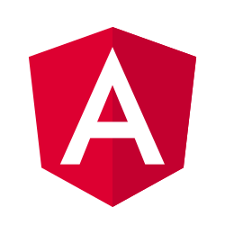
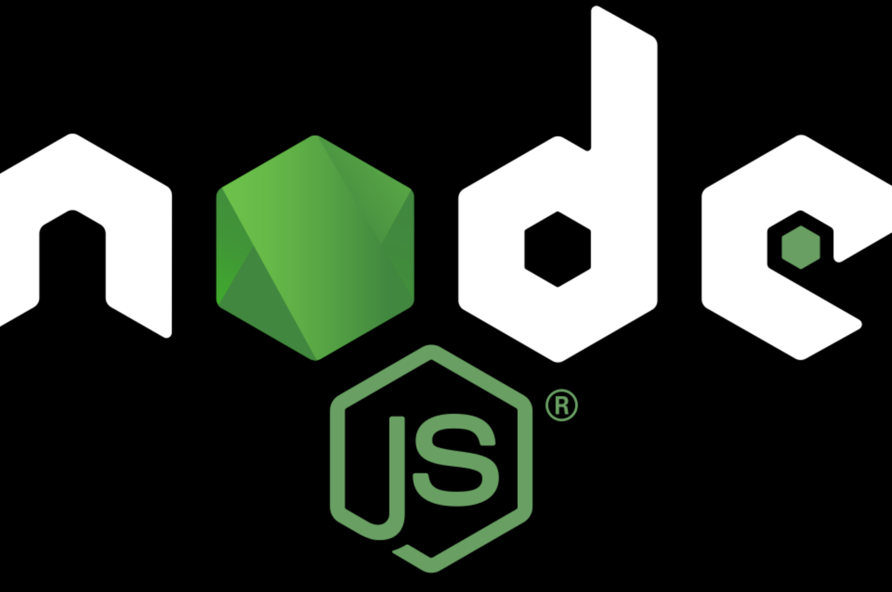

<!-- FLARUN  -->

<h1 align="center">

  
  

</h1>

###  About Me:

  Hi, I'm <b>Flavius Constantin Runceanu</b>, Computer Engineer and Data Scientist from ITALY.
   
   
  👨‍🎓 I studied Computer Science at the University of Luxembourg (Uni.lu). I am currently studying a Bachelor Degree in Computer Science and Engineering at the University of Brescia (Unibs.it)
   
   
  📊 I love looking into data, finding patterns, and learning everything about it!
   
  ⚔️ I love coding and solving complex problems!
   
   
  💻 I have 3+ years experience in Tensorflow, PyTorch, Keras, fast.ai, scikit-learn, pandas
   
  📚 I’m currently focusing on Machine Learning/Statistics.
   
  📈 I'm passionate about <b>Data Science, Deep Learning</b> and its applications in <b>Self-driving cars, Financial Models, Large Language Models</b>.
   
   
  <h3>
  📫 <b>How to reach me</b> 👇
  </h3>

  <!-- LINKEDIN -->

 <!-- EMAIL -->  <!-- WHATSAPP -->  <!-- TELEGRAM -->  <!-- FACEBOOK --> 

<h2 align="center">💻 Languages 💻</h2> 

<!-- Assembly, C, C++, C#, Java, Haskell, OCaml, Python, SQL, Javascript, TypeScript, PHP -->

  
  
  
  
  
  
    
  
  
  

<h2 align="center">⚙️ Frameworks & Tools 🔨</h2> 

<!-- Tensorflow, PyTorch, Fast.ai, Numpy, Matplotlib, Seaborn, ReactJS, Angular, PostgreSQL -->

  
  
  
  
  
  
  
  
  
  
  

<h2 align="center">🟢 Abilities 🟢</h2> 

<!-- Data Analysis, Deep learning model training and validation, Back end development, SQL databases -->

<h3 align="center"> Machine Learning/Deep Learning </h3>
<table align="center">
    <tr>
        <td><i>Skills</i></td>
        <td><i>Description</i></td>
    </tr>
    <tr>
        <td>Architecture Choice</td>
        <td>Choosing the right ML architecture for the right problem</td>
    </tr>
    <tr>
        <td>Hyperparameter Adjustment</td>
        <td>Adjusting the hyperparameters for optimal learning</td>
    </tr>
    <tr>
        <td>Model development</td>
        <td>Building the model from scratch</td>
    </tr>
    <tr>
        <td>Model Training</td>
        <td>Forward and backward propagation through data feed</td>
    </tr>
    <tr>
        <td>Model Validation</td>
        <td>Accuracy and functionality check and improvement</td>
    </tr>
    <tr>
        <td>Model Deployment and maintenance</td>
        <td>Production channel, adjustments, bug fixes</td>
    </tr>
</table>

  <h3 >SQL Database Management</h3>
  
  <h3 >Back End Web Development</h3>
  

<h2 align="center">⚡ Stats ⚡</h2>
 

  

