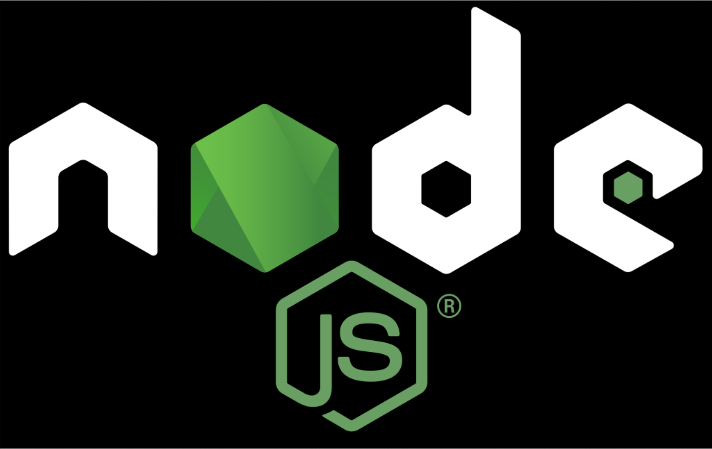

<!-- FLARUN  -->

<h1 align="center">

  
  

</h1>

###  About Me:

  Hi, I'm <b>Flavius Constantin Runceanu</b>, Computer Engineering student and self-taught applied math enthusiast based in ITALY.
   
   
  👨‍🎓 I am currently studying a Bachelor Degree in Computer Science and Engineering at the University of Brescia, Italy.
   
   
  📊 I love mathematics and its application in numerical and financial methods.
   
  ⚔️ I like complex problems and the endeavour of figuring out an elegant and functional solution for them.
   
   
  💻 I have 4+ years experience in Tensorflow, PyTorch, Keras, fast.ai, scikit-learn, pandas. I have 4+ linux and low level kernel experience.
   
  📚 I’m currently focusing on low level programming, financial mathematics, and applied mathematics.
   
  📈 I'm passionate about <b>Quantitative Finance and methods, Banking Infrastructures</b>.
   
   
  <h3>
  📫 <b>How to reach me</b> 👇
  </h3>

  <!-- LINKEDIN -->
<!--  <!-- EMAIL -->  <!-- WHATSAPP -->  <!-- TELEGRAM -->  <!-- FACEBOOK -->  -->

 <!-- EMAIL -->  <!-- WHATSAPP -->  <!-- TELEGRAM --> 

<h2 align="center">💻 Languages 💻</h2> 

<!-- Assembly, C, C++, C#, Java, Haskell, OCaml, Python, SQL, Javascript, TypeScript, PHP -->

  
  
  
  
  

<h2 align="center">⚙️ Frameworks & Tools 🔨</h2> 

<!-- Tensorflow, PyTorch, Fast.ai, Numpy, Matplotlib, Seaborn, ReactJS, Angular, PostgreSQL -->

  
  
  
  
  
  
  
  

<h2 align="center">🟢 Abilities 🟢</h2> 

<!-- Data Analysis, Deep learning model training and validation, Back end development, SQL databases -->

<h3 align="center"> Machine Learning - Deep Learning </h3>
<table align="center">
    <tr>
        <td><i>Skills</i></td>
        <td><i>Description</i></td>
    </tr>
    <tr>
        <td><b>Architecture Choice</b></td>
        <td>Choosing the right ML architecture for the right problem</td>
    </tr>
    <tr>
        <td><b>Hyperparameter Adjustment</b></td>
        <td>Adjusting the hyperparameters for optimal learning</td>
    </tr>
    <tr>
        <td><b>Model development</b></td>
        <td>Building the model from scratch</td>
    </tr>
    <tr>
        <td><b>Model Training</b></td>
        <td>Forward and backward propagation through data feed</td>
    </tr>
    <tr>
        <td><b>Model Validation</b></td>
        <td>Accuracy and functionality check and improvement</td>
    </tr>
    <tr>
        <td><b>Model Deployment and maintenance</b></td>
        <td>Production channel, adjustments, bug fixes</td>
    </tr>
</table>

<h3 align="center">SQL Database Management + Back End Web Development</h3> 

  
  

<h2 align="center">⚡ Stats ⚡</h2>
 

  

